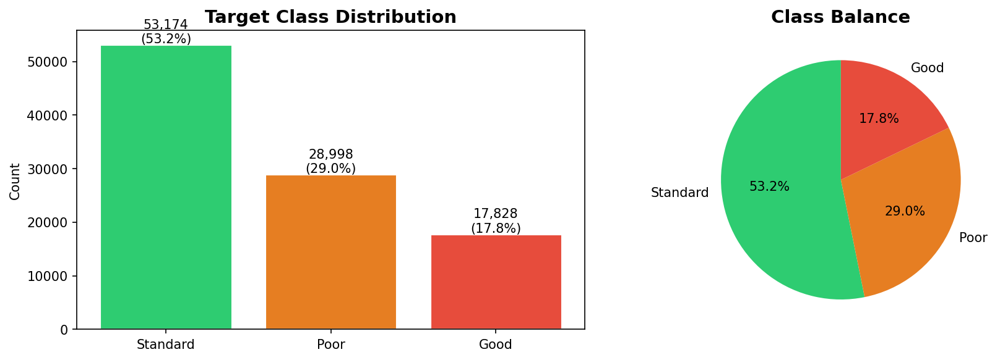
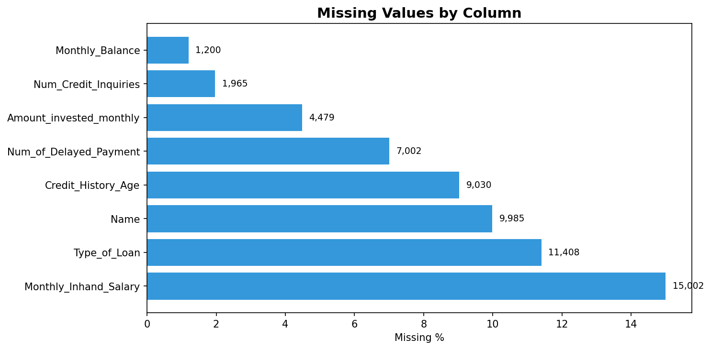
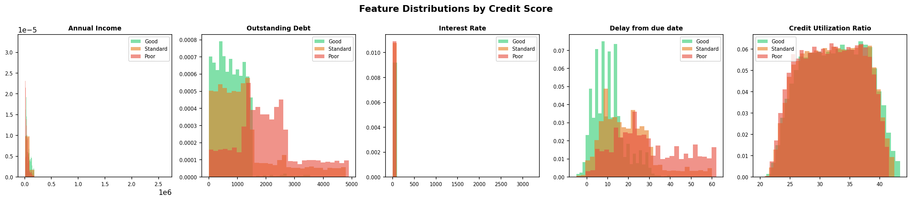
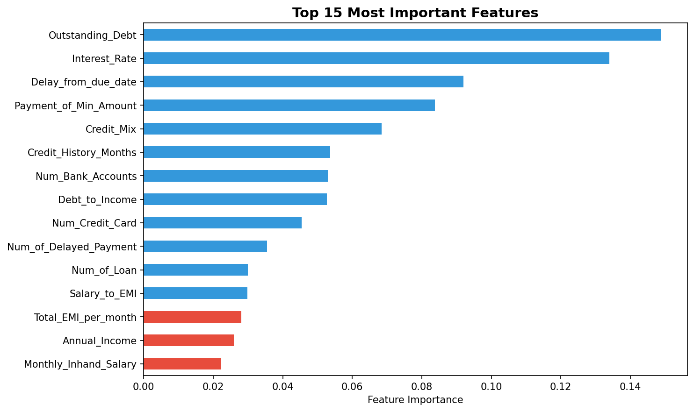
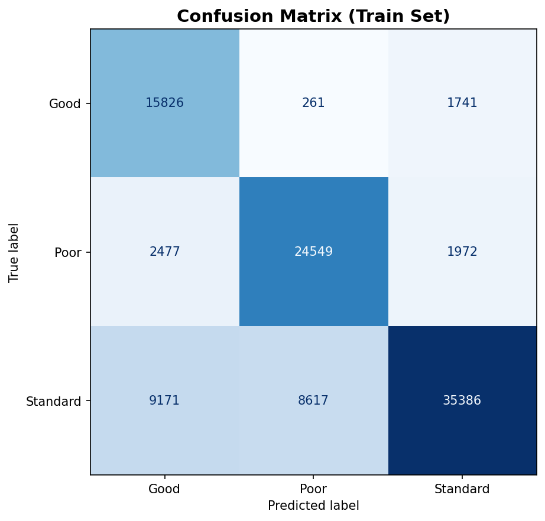

# 💳 Credit Score Classification — Machine Learning Project


> Predicting customer credit scores (Good / Standard / Poor) using machine learning on 100,000 real-world financial records — built as part of my **Machine Learning Internship** at **CodeAlpha**.

---

## 📌 Project Overview

Credit scoring is one of the most critical applications of machine learning in the financial industry. Banks and lenders use it to decide whether to approve loans, set interest rates, and manage risk. In this project, I built an end-to-end machine learning pipeline that classifies customers into three credit score categories — **Good**, **Standard**, and **Poor** — based on their financial history and behavioral patterns.

The dataset presented real-world challenges including dirty data, missing values, mixed data types, and class imbalance — all of which were handled systematically before modeling.

---

## 🎯 Objectives

- Clean and preprocess a messy, real-world financial dataset
- Perform exploratory data analysis to uncover patterns
- Engineer meaningful features from raw financial data
- Train and evaluate a classification model with class-imbalance handling
- Generate predictions on unseen test data and export results
- Build an interactive web app using Streamlit for live predictions

---

## 📁 Repository Structure

| File | Description |
|------|-------------|
| `credit_scoring_project.ipynb` | Main Jupyter Notebook — full pipeline |
| `app.py` | Streamlit Web App — interactive predictions |
| `credit_score_predictions.csv` | Test set predictions output |
| `feature_importances.csv` | Feature importance scores |
| `eda_target_distribution.png` | Class distribution chart |
| `eda_missing_values.png` | Missing values chart |
| `eda_feature_distributions.png` | Feature distributions chart |
| `feature_importance.png` | Feature importance chart |
| `confusion_matrix.png` | Confusion matrix chart |
| `README.md` | Project documentation |

---

## 📊 Dataset

| Property | Detail |
|----------|--------|
| Training samples | 100,000 rows |
| Test samples | 50,000 rows |
| Features | 28 columns |
| Target variable | `Credit_Score` (Good / Standard / Poor) |
| Class distribution | Standard 53.2% · Poor 29.0% · Good 17.8% |

> 📥 Dataset not included due to large file size.  

> **[Click here to Download Dataset](https://drive.google.com/drive/folders/1pjynax8Y3GlhZ-4dxaGvTKda6m6ZlxBP?usp=sharing)**


### Key Features Used

| Feature | Description |
|---------|-------------|
| `Annual_Income` | Customer's yearly income |
| `Outstanding_Debt` | Total current debt |
| `Interest_Rate` | Average interest rate on credit |
| `Delay_from_due_date` | Days late on payments |
| `Credit_History_Age` | Length of credit history |
| `Credit_Mix` | Quality of credit portfolio (Good/Standard/Bad) |
| `Payment_Behaviour` | Spending and payment pattern category |
| `Num_of_Delayed_Payment` | Count of missed/late payments |
| `Credit_Utilization_Ratio` | % of credit limit being used |

---

## 🛠️ Tech Stack

| Tool | Purpose |
|------|---------|
| Python 3.10 | Core language |
| pandas & NumPy | Data manipulation |
| scikit-learn | ML pipeline, preprocessing, modeling |
| Matplotlib & Seaborn | Data visualization |
| Jupyter Notebook | Development environment |
| Streamlit | Interactive web application |

---

## 🔧 Pipeline Walkthrough

### 1. Data Cleaning
The raw data contained several quality issues that were resolved:
- **Dirty numeric fields** — columns like `Age` contained values like `"-500"` and `"24_"`, stripped and corrected
- **Placeholder strings** — `"_______"` in `Occupation` replaced with `NaN`
- **Text-encoded numbers** — `Credit_History_Age` stored as `"22 Years and 3 Months"` was parsed into total months (integer)
- **Negative delays** — `Delay_from_due_date` clipped to 0 (negative values are physically impossible)
- **Invalid categories** — `Credit_Mix` values outside `Good/Bad/Standard` replaced with `NaN`

### 2. Exploratory Data Analysis
- Visualized class imbalance (Standard-heavy distribution)
- Plotted missing value rates per column
- Compared key feature distributions across credit score categories
- Found that customers with Poor scores consistently show higher interest rates, more payment delays, and larger outstanding debt

### 3. Feature Engineering
Two new features were created to improve signal:

| New Feature | Formula | Insight |
|------------|---------|---------|
| `Debt_to_Income` | `Outstanding_Debt / Annual_Income` | Captures financial stress ratio |
| `Salary_to_EMI` | `Monthly_Inhand_Salary / Total_EMI_per_month` | Measures loan repayment burden |

### 4. Preprocessing Pipeline (sklearn)
- **Numeric features** → Median imputation
- **Categorical features** → Mode imputation + Ordinal encoding
- Built using `ColumnTransformer` + `Pipeline` for clean, reproducible transforms

### 5. Model Training
- **Algorithm:** Random Forest Classifier
- **Trees:** 100 estimators, max depth 15
- **Class imbalance handling:** `class_weight='balanced'`
- **Random state:** 42 (reproducible results)

---

## 🖼️ Visualizations

### Target Class Distribution


### Missing Values Analysis


### Feature Distributions by Credit Score


### Top 10 Feature Importances


### Confusion Matrix


---

## 📈 Results

| Metric | Score |
|--------|-------|
| Train Accuracy | **75.8%** |
| Train F1 (weighted) | **76.1%** |

### Per-Class Performance

| Class | Precision | Recall | F1-Score | Support |
|-------|-----------|--------|----------|---------|
| Good | 0.58 | 0.89 | 0.70 | 17,828 |
| Poor | 0.73 | 0.85 | 0.79 | 28,998 |
| Standard | 0.91 | 0.67 | 0.77 | 53,174 |
| **Weighted Avg** | **0.80** | **0.76** | **0.76** | **100,000** |

### Top 10 Most Important Features

| Rank | Feature | Importance |
|------|---------|------------|
| 1 | Outstanding Debt | 14.9% |
| 2 | Interest Rate | 13.4% |
| 3 | Delay from Due Date | 9.2% |
| 4 | Payment of Min Amount | 8.4% |
| 5 | Credit Mix | 6.8% |
| 6 | Credit History (months) | 5.4% |
| 7 | Num Bank Accounts | 5.3% |
| 8 | Debt to Income ratio | 5.3% |
| 9 | Num Credit Cards | 4.5% |
| 10 | Num Delayed Payments | 3.5% |

**Key insight:** Outstanding debt and interest rate alone explain ~28% of the model's decisions, confirming that current financial burden is the strongest signal for credit risk.

---

## 🚀 How to Run

### 📓 Run Jupyter Notebook

```bash
# 1. Clone the repository
git clone https://github.com/UjjalaMustafa/CodeAlpha_CreditScoring.git
cd CodeAlpha_CreditScoring

# 2. Install dependencies
pip install pandas numpy scikit-learn matplotlib seaborn jupyter

# 3. Open the notebook
jupyter notebook credit_scoring_project.ipynb
```

> Run all cells from top to bottom. Predictions will be saved automatically as `credit_score_predictions.csv`.

---

### 🌐 Run Streamlit Web App

```bash
# 1. Install streamlit
pip install streamlit

# 2. Run the app
streamlit run app.py
```

> App will open automatically at `http://localhost:8501`  
> Upload `train.csv` from the sidebar to activate EDA, Model, and Predict features!

---

## 🌐 Streamlit Web App Features

This project includes a fully interactive web app built with Streamlit!

| Tab | What it does |
|-----|-------------|
| 🏠 **Overview** | Project summary, key metrics, tech stack |
| 📊 **EDA** | Interactive class distribution and missing values charts |
| 🤖 **Model & Results** | Feature importance chart, per-class performance table |
| 🔮 **Predict** | Fill a form with customer details → get instant credit score prediction |

**To run the app:**
```bash
pip install streamlit
streamlit run app.py
```

---

## 💡 What I Learned

- How to handle real-world messy data — missing values, wrong types, and outliers are the norm, not the exception
- Building reproducible sklearn `Pipeline` objects that prevent data leakage between train and test
- How `class_weight='balanced'` helps when one class dominates the dataset
- Feature engineering can add more value than model tuning — `Debt_to_Income` turned out to be a top-10 predictor
- Interpreting `classification_report` to understand where the model struggles (the "Good" class had lower precision because it was the minority class)

---

## 🔮 Future Improvements

- **Aggregate per customer** — each customer has 8 monthly records; rolling aggregates (avg delay, trend in debt) would add powerful longitudinal features
- **Try XGBoost / LightGBM** — gradient boosting often outperforms Random Forest on tabular financial data
- **Encode `Type_of_Loan`** — this multi-label column was dropped; splitting into binary indicator columns per loan type could add signal
- **Hyperparameter tuning** — `GridSearchCV` or `Optuna` to find optimal tree depth, estimators, min samples
- **SHAP values** — for explainability beyond feature importances (important for real financial applications)

---

## 👤 Author

**Ujjala Mustafa**
Machine Learning Intern — CodeAlpha (Remote, 1 Month)

[](https://www.linkedin.com/in/ujjala-mustafa-251511246)
[](https://github.com/UjjalaMustafa)
[](mailto:ujjalamustafa.pk@gmail.com)

---

## 📄 License

This project is open for educational and portfolio purposes.
Dataset used for academic/internship work only.
